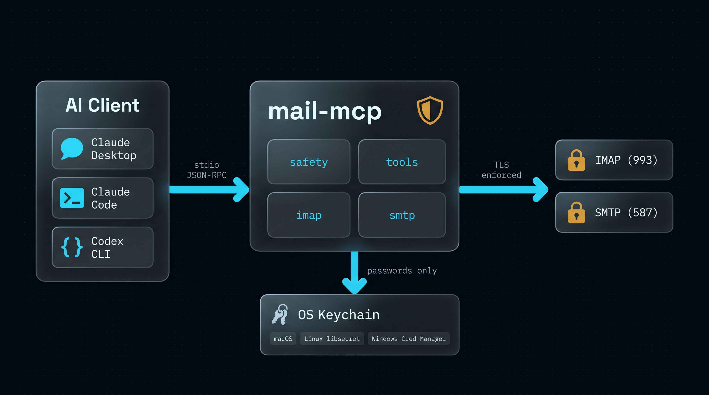

<div align="center">


# mail-mcp

**Privacy-first IMAP/SMTP MCP server for Claude Desktop, Claude Code, and Codex CLI.**

Give your AI assistant real access to your mailbox — read, search, draft, organise — without sending a single credential to anyone's server.

[](LICENSE)
[](https://www.python.org/downloads/)
[](https://modelcontextprotocol.io/)
[](#security)

</div>

## Why this exists

I wanted my Claude Code (and Codex) sessions to understand my inbox: find the last email from a client, pull the PDF they sent, draft a reply, archive the newsletter bulk. There are already nine MCP servers that claim to do this. I audited the code of all of them in parallel and the pattern was uncomfortable — **plaintext passwords on disk, hardcoded TLS bypasses, "AES-256 encrypted" credential stores where the key is literally `hostname + username`, OAuth client secrets embedded in the binary, and zero-config relays that route your IMAP password through the author's own domain**.

`mail-mcp` is what I wish one of them had been.

## Highlights

- 🔐 **Your password never touches a file.** It lives in the OS keyring — macOS Keychain, Linux Secret Service, Windows Credential Manager — via [`keyring`](https://pypi.org/project/keyring/). The config file only stores host/port/user/alias.
- 🛡️ **TLS is mandatory.** IMAP uses implicit TLS (port 993). SMTP uses STARTTLS (587) or SMTPS (465). There is no knob to disable certificate verification.
- 🧱 **Prompt-injection hardened.** Email bodies are wrapped in an `<untrusted_email_content>` envelope with an explicit warning; closing-tag breakouts and zero-width injection characters are neutralised before the model sees them.
- 🚪 **Write access is gated by default.** Destructive tools are *not even registered* unless you opt in via environment variables. `send_email` additionally requires a second flag and an explicit `confirm=true`.
- 🪶 **Small, auditable, four direct dependencies.** `mcp`, `imapclient`, `keyring`, `pydantic`. No web UI, no telemetry, no update checks, no relays, no phone-home.
- 🧰 **Clean tool surface** — structured IMAP search (no concatenation), bounded outputs, path-traversal-safe attachment saves.

## Architecture

<div align="center">

</div>

Three layers: your AI client talks MCP JSON-RPC over stdio, `mail-mcp` enforces the safety rules, the world only ever sees TLS-wrapped IMAP or SMTP to the host you configured. Passwords flow one way only: from the OS keyring into a short-lived IMAP/SMTP session.

## Tools

| Tool | Read-only | Mode | What it does |
|------|:---------:|------|--------------|
| `list_folders` | ✅ | default | List mailboxes on the account |
| `search_emails` | ✅ | default | Structured IMAP search (subject/from/to/since/flags/…) |
| `get_email` | ✅ | default | Fetch a message, body wrapped in XPIA envelope |
| `list_attachments` | ✅ | default | Attachment metadata for a message |
| `download_attachment` | ✅ | default | Save an attachment to `~/Downloads/mail-mcp/<alias>/` |
| `save_draft` | ✍️ | default | Build a MIME draft and store it in Drafts (preferred write path) |
| `move_email` | ⚠️ | `MAIL_MCP_WRITE_ENABLED=true` | Move messages between mailboxes |
| `mark_emails` | ⚠️ | `MAIL_MCP_WRITE_ENABLED=true` | Set/clear Seen and Flagged |
| `delete_emails` | 🗑️ | `MAIL_MCP_WRITE_ENABLED=true` | Move to Trash by default; permanent delete double-gated |
| `send_email` | 🚀 | `MAIL_MCP_WRITE_ENABLED=true` + `MAIL_MCP_SEND_ENABLED=true` + `confirm=true` | Send via SMTP |

When `MAIL_MCP_WRITE_ENABLED` is unset (the default), the write tools **are not visible to the model at all** — it cannot enumerate them, let alone call them.

## Install

```bash
# Until PyPI release — install straight from the repo:
pip install "git+https://github.com/mario-hernandez/mail-mcp.git@main"
```

Requires Python ≥ 3.11. On Linux make sure `libsecret` is installed (most desktops have it); on Windows and macOS the keyring backend ships with the OS.

A full step-by-step integration guide (including Claude Desktop / Claude Code / Codex CLI config snippets and provider hosts) lives at [`docs/INTEGRATION.md`](docs/INTEGRATION.md).

## Setup

### The quick path — interactive wizard

```bash
pip install "mail-mcp[cli] @ git+https://github.com/mario-hernandez/mail-mcp.git@main"
mail-mcp init
```

`mail-mcp init` asks for your email address, auto-detects the IMAP and SMTP endpoints for your provider (Gmail, iCloud, Outlook.com, Fastmail, Yahoo, IONOS, GMX, Zoho, mailbox.org, Yandex, custom domains hosted on Google Workspace / Microsoft 365, and others), prompts for your password, tests the login live against both servers, and saves the account to the OS keyring. No flags to remember.

### The scripted path

```bash
mail-mcp add-account personal m@example.com \
  --imap-host imap.example.com --imap-port 993 \
  --smtp-host smtp.example.com --smtp-port 587

mail-mcp check --alias personal
mail-mcp serve
```

### Claude Desktop

Add to `~/Library/Application Support/Claude/claude_desktop_config.json`:

```json
{
  "mcpServers": {
    "mail-mcp": {
      "command": "mail-mcp",
      "args": ["serve"]
    }
  }
}
```

To enable write tools, add an `env` block:

```json
{
  "mcpServers": {
    "mail-mcp": {
      "command": "mail-mcp",
      "args": ["serve"],
      "env": {
        "MAIL_MCP_WRITE_ENABLED": "true"
      }
    }
  }
}
```

### Claude Code

```bash
claude mcp add mail-mcp mail-mcp serve
```

To enable writes:

```bash
claude mcp add --env MAIL_MCP_WRITE_ENABLED=true mail-mcp mail-mcp serve
```

### Codex CLI

`~/.codex/config.toml`:

```toml
[mcp_servers.mail-mcp]
command = "mail-mcp"
args    = ["serve"]

[mcp_servers.mail-mcp.env]
MAIL_MCP_WRITE_ENABLED = "true"   # optional
```

## Provider support

| Provider | Works with `mail-mcp init` | Notes |
|----------|---------------------------|-------|
| IONOS, Fastmail, mailbox.org, GMX, Web.de, Zoho, Yandex | ✅ | Native password or app password |
| Gmail | ✅ with app password | Enable 2FA, then generate at [myaccount.google.com/apppasswords](https://myaccount.google.com/apppasswords) |
| iCloud | ✅ with app password | Required; generate at appleid.apple.com |
| Outlook.com personal | ✅ with app password | Generate at account.live.com |
| Microsoft 365 (tenant managed) | ⚠️ basic-auth disabled | OAuth2 is planned for v0.2.2. Use `email-oauth2-proxy` locally as a stopgap. |
| Proton Mail | ✅ via Bridge | Run Proton Bridge; `mail-mcp init` detects the `proton.me` domain and points at `127.0.0.1:1143` |
| Custom domain on any of the above | ✅ | Autoconfig resolves via MX / SRV / `autoconfig.<domain>` |

See [`docs/TROUBLESHOOTING.md`](docs/TROUBLESHOOTING.md) for the common
failures and their fixes.

## Environment variables

| Variable | Default | Purpose |
|----------|---------|---------|
| `MAIL_MCP_WRITE_ENABLED` | `false` | Register `move_email`, `mark_emails`, `delete_emails`. |
| `MAIL_MCP_SEND_ENABLED` | `false` | Register `send_email` (additionally requires write). |
| `MAIL_MCP_ALLOW_PERMANENT_DELETE` | `false` | Allow `permanent=true` on `delete_emails`. |
| `MAIL_MCP_LOG_LEVEL` | `WARNING` | Server log level on stderr (`DEBUG` / `INFO` / `WARNING` / `ERROR`). |
| `MAIL_MCP_IMAP_CONNECT_TIMEOUT` | `15` | IMAP TCP + TLS handshake timeout, seconds. |
| `MAIL_MCP_IMAP_READ_TIMEOUT` | `30` | IMAP socket read timeout, seconds. |

## Example prompts

Once connected, talk to your AI assistant in plain language:

- *"Find the last email from Imma and summarise it for me."*
- *"List all attachments from this week's emails with subject containing 'contract'."*
- *"Draft a reply to the UID 4231 email thanking them and confirming the meeting on Thursday."*
- *"Move all 'GitHub notifications' older than 30 days to my Archive folder."* (requires `MAIL_MCP_WRITE_ENABLED=true`)

## Security

Extensive threat model in [SECURITY.md](SECURITY.md) and [docs/THREAT_MODEL.md](docs/THREAT_MODEL.md). Short version:

- No plaintext credential storage.
- No outbound network beyond your IMAP/SMTP host.
- Structured IMAP SEARCH (no injection).
- CRLF-injection defence in every header-bound string.
- XPIA wrapper on every email body returned to the LLM.
- Destructive tools require explicit opt-in flags *and* argument confirmation.
- Four direct dependencies, reproducible builds, no postinstall hooks.

To report a vulnerability: email `m@mariohernandez.es` with the subject prefix `[mail-mcp]`. Please do not open a public GitHub issue for security reports.

## Development

```bash
git clone https://github.com/mario-hernandez/mail-mcp
cd mail-mcp
python3 -m venv .venv && . .venv/bin/activate
pip install -e ".[dev]"
pytest         # 45+ tests, all green
ruff check src tests
```

## Non-goals (for v0.1)

- OAuth2 (planned for v0.2 — Gmail/Outlook without app passwords).
- Multiple-account switching at tool-call time (single default account wins in v0.1).
- HTTP/SSE transport.
- Web UI.
- Calendar integration.

Keeping the surface tiny is a feature, not a shortcoming.

## License

[MIT](LICENSE). Do whatever you want — credit is appreciated, pull requests even more so.

## Acknowledgements

The design was informed by a parallel audit of nine existing email MCP servers. Patterns that worked well in `codefuturist/email-mcp`, `thegreystone/mcp-email`, and `bradsjm/mail-imap-mcp-rs` — structured SEARCH, XPIA envelopes, write-gating, prompt-injection-aware tool descriptions — were adapted here with attribution in spirit. The mistakes in the others (hardcoded `rejectUnauthorized: false`, theatrical "encryption", CRLF injection, author-hosted credential relays) informed the non-goals.

If you build something on top of `mail-mcp`, I'd love to hear about it.
